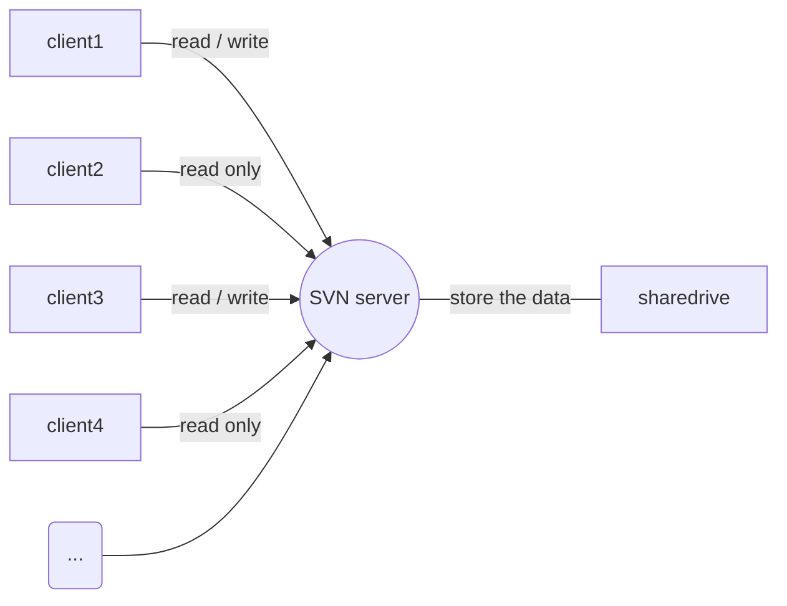

## vscode画图

### 环境安装
* 安装vscode插件: Markdown Preview Enhanced 
* 安装puppeteer: sudo cnpm install -g puppeteer

### 流程图
```flow
st=>start: 流程开始
e=>end: 流程结束
 
op1=>operation: 选手准备
op2=>operation: 开始循环
op3=>operation: 执行循环语句
op4=>operation: 循环结束 
 
cond1=>condition: 准备好了么
cond2=>condition: 判断循环条件
 
 
st->op1->cond1
cond1(yes, right)->op2(right)->cond2
cond1(no)->op1
cond2(yes)->op3->cond2
cond2(no)->op4->e
```
### 关系图

### 其他图形语法探索中...
